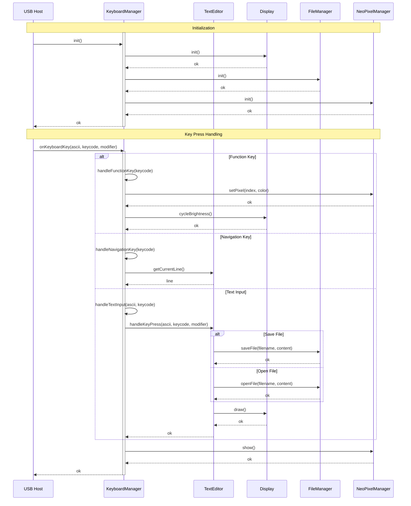

# Keyboard MF System Documentation

## Class Diagram

```mermaid
classDiagram
    namespace keyboard {
        class KeyboardManager {
            -m_display: Display
            -m_editor: TextEditor
            -m_file_manager: FileManager
            -m_pixels: NeoPixelManager
            +init() bool
            +process() void
            +reset() void
            #onKeyboardKey(ascii: uint8_t, keycode: uint8_t, modifier: uint8_t) void
            -handleFunctionKey(keycode: uint8_t) void
            -handleNavigationKey(keycode: uint8_t) void
            -handleTextInput(ascii: uint8_t, keycode: uint8_t) void
        }

        class Display {
            -m_lcd: LGFX
            -m_sprite: LGFX_Sprite
            -m_text_sprite: LGFX_Sprite
            -m_brightness_index: uint8_t
            +init() void
            +setBrightness(level: uint8_t) void
            +cycleBrightness() void
            +drawText(text: string, x: int, y: int, size: int, color: uint16_t) void
            +drawLine(x1: int, y1: int, x2: int, y2: int, color: uint16_t) void
            +fillRect(x: int, y: int, w: int, h: int, color: uint16_t) void
            +clearRect(x: int, y: int, w: int, h: int) void
            +clearScreen() void
        }

        class TextEditor {
            -m_mode: Mode
            -m_caps_lock: bool
            -m_current_line: int
            -m_max_line: int
            -m_file_name: string
            -m_text_lines: array<string>
            -m_spaces: array<string>
            -m_draw_line: bool
            +reset() void
            +handleKeyPress(ascii: uint8_t, keycode: uint8_t, modifier: uint8_t) void
            +saveFile() bool
            +openFile(filename: string) bool
            +draw(display: Display) void
            +toggleMode() void
            +toggleCapsLock() void
        }

        class FileManager {
            -m_menu_open: bool
            -m_selected_file_index: int
            -m_file_list: vector<string>
            +init() bool
            +saveFile(filename: string, content: vector<string>) bool
            +openFile(filename: string, content: vector<string>) bool
            +listFiles(files: vector<string>) void
            +setMenuOpen(open: bool) void
            +incrementSelectedFile() void
            +decrementSelectedFile() void
            -updateFileList() void
        }

        class NeoPixelManager {
            -m_strip: NeoPixelBus
            +init() bool
            +setBrightness(brightness: uint8_t) void
            +setPixel(index: uint16_t, color: uint32_t) void
            +setAllPixels(color: uint32_t) void
            +clear() void
            +show() void
        }

        KeyboardManager *-- Display
        KeyboardManager *-- TextEditor
        KeyboardManager *-- FileManager
        KeyboardManager *-- NeoPixelManager
        TextEditor ..> Display
        TextEditor ..> FileManager
    }
```

## Sequence Diagram



### Key Components

1. **KeyboardManager**: Central controller that manages keyboard input and coordinates between components
2. **Display**: Handles all display-related operations using LGFX library
3. **TextEditor**: Manages text editing functionality with two modes (FileName and TextEdit)
4. **FileManager**: Handles file operations and menu navigation
5. **NeoPixelManager**: Controls LED lighting effects

### Key Interactions

1. **Initialization Flow**:

   - System initializes each component in sequence
   - Display → FileManager → NeoPixelManager

2. **Key Press Handling**:

   - Function Keys: Triggers LED and brightness controls
   - Navigation Keys: Updates cursor position and text selection
   - Text Input: Handles text editing, file operations, and display updates

3. **Component Dependencies**:
   - KeyboardManager owns all other components
   - TextEditor depends on Display for rendering
   - TextEditor depends on FileManager for file operations
     </rewritten_file>
